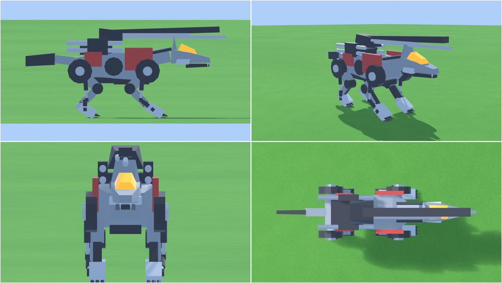

# Ver1.1 評価と Ver2.0 への改善点（Opus レビュー 2026-09-30）

- 評価の手順と依頼文: `docs/opus_review_request.md`
- 比べたもの: `references/cw_01.webp`（RMZ 斜め前）、`cw_package_irvine.jpg`（アーバイン仕様の配色）、`cw_img0.jpg`（後ろ姿）、`cw_img2.jpg`（HMM）
- 現状: 4面図 `docs/img/v1_1_review_sheet.jpg`、ギャロップのコマ割り `docs/img/v1_1_gallop_sheet.jpg`
- Ver1.1 は git タグ `v1.1` で保存済み（試作として残す）

---

## 総評（3行）
1. **動きの土台（歩容・IK・足の接地）は合格**。作り直さずに拡張する。
2. **ゾイドに見えない最大の原因はプロポーション**。脚が細長く、胴が高く、首が板で露出しているため「テーブル脚のロボット犬」に見える。ディテールより先にここを直す。
3. 配色が明るい青灰色なので玩具っぽい。アーバイン仕様は「ほぼ黒のガンメタ + 赤 + 白い関節キャップ + オレンジのキャノピー」。

---

## A. 参考画像との差（優先度つき）

P1 = シルエットが変わる / P2 = 部位の形 / P3 = 仕上げ

| 優先 | 部位 | 現状 | 参考画像 | 直し方（数値の目安） | 場所 |
|---|---|---|---|---|---|
| P1 | 胴の高さ・脚の長さ | 腹の高さ 1.33m が胴の厚み 0.85m の約1.6倍。脚が長く見える | 腹から地面までが胴の厚みとほぼ同じ | 胴の厚み 0.85→**1.0**、股関節の高さ 1.6→**1.35**、`L1=L2` 0.85→**0.72**、`ANKLE_Z` 0.40→**0.32** | `wolf.py` `HIPS` `L1/L2` `P` |
| P1 | 脚の太さ | 大腿 0.30、すね 0.20 の棒 | 大腿は胴の厚みの半分ほどの太いブロック | 大腿 **0.46×0.50**、すね **0.34×0.36**、足首の上に段付きの装甲 | `make_model` 脚 |
| P1 | 脚の位置 | 正面から見ると脚が胴の外側に立ち、テーブル脚に見える | 脚は胴の真下。丸い股関節カバーだけが外に張り出す | 脚の x を ±0.62→**±0.45**、股関節ディスクは外側のまま大きく **r0.48** | `HIPS` |
| P1 | 首 | 板状の首が露出し、頭と胴に隙間 | 首はほぼ見えず、頭が胸の前に直接付く | 首の骨は残し、メッシュは**胸の装甲で首を覆う**（首カバーを `chest` に付ける）。首の長さ 0.77→**0.5** | `P["neck"]` `P["head"]` |
| P1 | 配色 | 明るい青灰 (0.30) | 黒に近いガンメタ | gray **0.06**、dark **0.015**、red **(0.30,0.015,0.01)**、関節キャップ **白 0.8** を追加 | `COL` |
| P2 | 頭部 | 細い凸包、キャノピーが小さい、耳が細い棘1本 | 長いくさび形。キャノピーが額から鼻先近くまで覆う。耳は黒い背びれ状の三角が2枚 | キャノピーを長さ **0.9m**・幅 0.4 に、耳を幅広の三角 **高さ0.45** で2枚、口を開けた形で上下に歯列（小さな三角を6〜8本ずつ） | `make_model` 頭 |
| P2 | 尾 | 棒 | 平たい大きな刃形。後ろ上方へ伸びる | 平板の凸包 **長さ1.4・幅0.7・厚み0.12**、上向き **15°** | 尾 |
| P2 | 2連装ビーム砲 | 胴の上で前後に伸びる棒2組 | 腰の上から**後ろ向き**に伸びる。先端は白 | 砲身を後ろ向きに、先端に白いキャップ。銀色の曲がったパイプで胴とつなぐ | 胴体 |
| P2 | 背部の長砲身 | 箱の台座 + 棒 | 大きなくさび形のハウジングが肩の上から前へ | 台座を後ろ高・前低の**くさび形の凸包**に、砲身は角断面の長い板 + 細い丸砲身 | 背部砲 |
| P2 | 赤い装甲 | 胴の側面に赤い箱が前後2枚 | 前脚の肩に**L字の赤い板**（丸い穴あき）。後ろ側は黒 | 前は L 字の板を大腿の上部に（`chest` でなく **肩骨**に付ける）、後ろの赤は黒に | 装甲 |
| P2 | 足 | 薄い斜めの板 + 爪 | 大きく四角い肉球のブロックに指が3〜4本 | 足を**箱 0.42×0.5×0.22** + 指ブロック4つ。足首に白い丸キャップ | 足 |
| P3 | 角の処理 | 角が鋭く、光が乗らない | プラモデルの面取り | 全パーツに **Bevel モディファイア**（幅 0.015、2段、Harden Normals）+ Weighted Normal | `Parts.build` |
| P3 | ホース | なし | 黒い蛇腹ホースが背→首、肩→脚 | 曲線(Curve)に太さを付け、両端をフックで別の骨に付ける | 新規 |
| P3 | パネル | なし | 段差、スリット、リブ | Ver2.0 の後半。インセットや細い溝の箱で表現 | ― |

### 動き（ギャロップ）について
- 良い点: 後脚→前脚の着地順、浮遊期、背骨の曲げは「駆けている」感が出ている。
- 足りない点:
  1. **肩甲骨の動きが無い**ため、前脚の踏み出しが短い。本物の四足は肩ごと前後にスライドする（→ B の肩骨）。
  2. **足首から先が一枚板**なので、蹴り出しでつま先が反らず、着地で足が地面に平らに付かない（→ B の指骨）。
  3. 頭の位置が上下に揺れすぎる。狼は走るとき頭を低く、ほぼ水平に保つ。頭の上下を **1/3** に、全体を **10°** 下げる。
  4. 尻尾は走行中、後方へ水平に流す（今は振りが大きく横に振れる）。横の振りを **1/3** に。

---

## B. リグの構成見直し

現状（20本 + ダンパー16本）は土台として正しい。以下を**追加**する。

| 優先 | 追加する骨 | 親 | 理由 |
|---|---|---|---|
| P1 | `FL_shoulder` `FR_shoulder`（肩甲骨） | `chest` | 前脚の付け根を前後に **±0.15m** スライドさせ、踏み出しを伸ばす。赤い肩装甲もここに付ける |
| P1 | `**_toe`（指） | `**_foot` | 接地中は足を地面に平らに保ち、蹴り出しでつま先を反らせる |
| P2 | `canopy`（キャノピー） | `head` | チェックリスト1のヒンジ開閉。ヒンジは後ろ端 |
| P2 | `turret`（旋回台）→ `cannon`（砲身の上下） | `body` | 旋回と俯仰を分ける。狙う動きの準備 |
| P2 | `beam_gun`（2連装砲） | `body` | 走行中の揺れを独立させる |
| P3 | `tail3` | `tail2` | 刃形の尾先をしならせる |

### コントロール骨（手で直せる仕組み）
- 今は Python が毎フレーム全部の骨にキーを打つ「焼き込み」なので、GUI で足の位置だけ直す、ができない。
- 追加案: 足ごとに **IKターゲット骨**（`IK_FL` など、親は `root`）と**ポール骨**を置き、Python は**ターゲット骨にだけキーを打つ**。脚の骨は Blender の IK 制約で解く。
  - 利点: GUI でターゲットを掴んで足の位置を直せる。学習用にも見える。
  - 注意: Blender の IK と自前の `solve_leg` で膝の向きが一致するよう、ポールの位置を合わせる。
- **判断保留**: 焼き込み方式を続けるか、コントロール骨方式にするかはユーザーが選ぶ。自動生成だけで完結するなら焼き込みで十分。GUI で手修正したいならコントロール骨。

### 歩容の切り替え（横ステップ・斜めステップの前提）
- 今は1本の動画で歩容が1種類。切り替えのために:
  1. 脚ごとの**位相を積算**する（周期が変わっても位相が飛ばない）
  2. 歩容のパラメータ（速度・duty・位相差・胴の動き）を**区間ごとに補間**する
  3. 進行方向 `dir` と**胴の向き(ヨー)**を分ける。斜めステップは「胴は前、進行は斜め」、旋回は「胴ごと曲がる」
  4. 横ステップ用に、胴を進行方向へ **5〜8°** 傾ける（ロール）
- 足滑りの自動チェックを追加する: 接地中の足首のワールド速度が **0.05m/s 以下**かを全フレーム検査するスクリプト（`src/check_foot_slide.py`）。歩容を足すたびに回す。

---

## C. Ver2.0 のメッシュ設計

### パーツ分割
- メカなので**剛体スキニング（1パーツ=1骨）を継続**。ウェイトペイントは不要。
- オブジェクト名を `CW_<骨>_<部品>`（例 `CW_head_canopy`）に統一し、部品単位で差し替えられるようにする。
- 関節は必ず**円柱のキャップで隠す**（回したときに隙間が見えない）。

### ポリ数の目安
| 部位 | 三角形数 |
|---|---|
| 頭部（キャノピー・歯・耳含む） | 4,000 |
| 胴体・装甲 | 6,000 |
| 脚 4本（ダンパー含む） | 4 × 2,500 = 10,000 |
| 背部砲・2連装砲 | 3,000 |
| 尾・ホース | 2,000 |
| **合計** | **約 25,000**（Bevel 込み。EEVEE で十分軽い） |

### ディテールの段階
1. **L0 シルエット**: A の P1（プロポーション・脚・首・配色）。真横と正面の4面図が参考に近づくまで。
2. **L1 部位の形**: A の P2（頭・尾・砲・装甲・足）
3. **L2 面取りと関節キャップ**: Bevel、白いキャップ
4. **L3 ホースとパネル**: 曲線のホース、溝、リブ

各段階の終わりで `review_shots.py` の4面図を撮り、この文書の表と見比べる。

### 作り方の比較

| | ① Opus 設計 + Sonnet が Python で組む | ② Hunyuan3D で形を出して切り分け |
|---|---|---|
| リグとの相性 | ◎ 最初から骨ごとの部品 | △ 一体成形。関節で切ると断面に穴、回すと隙間 |
| ディテール | △ 箱・凸包の組み合わせ。曲面は苦手 | ◎ 一発でそれらしい |
| 再現性 | ◎ Python から再生成 | △ 生成のたびに形が変わる |
| 修正のしやすさ | ◎ 数値を変えるだけ | × 高密度メッシュの手修正 |
| 前提 | なし | Tencent 登録（未実施）、利用条件の確認 |

**推奨: ① を本線にする。** ② は登録してから、**頭部だけ**生成して形の参考にする使い方が効果的（頭部が一番「らしさ」を決め、かつ一番作りにくい）。

---

## 作業順（Sonnet への指示単位）

1. `COL` を暗い配色に変え、白いキャップの材質を足す（5分で見た目が大きく変わる）
2. プロポーション変更: `HIPS`、`L1/L2`、`ANKLE_Z`、胴の寸法、首の長さ → 4面図で確認
3. 脚の太さと足の形 → 歩行シートで足が地面に平らに付くか確認
4. 肩骨と指骨を追加し、`pose_frame` に肩のスライドと指の反りを足す
5. 頭部の作り直し（キャノピー・耳・歯列）、首カバー
6. 尾・2連装砲の向き・背部砲のくさび形・L字の赤装甲
7. Bevel + Weighted Normal
8. `check_foot_slide.py` を追加
9. 歩容の切り替え（位相の積算・補間・胴のヨー）→ 横ステップ・斜めステップ
10. ホース、パネル（L3）

1〜3 を終えた時点で、もう一度この評価（4面図と参考画像の比較）を行う。

### 進捗（2026-09-30）
- 1〜3 完了（`docs/img/v2_step1-3_check.jpg`）
- 4 完了: 肩甲骨・指の骨、リグは**組み合わせ方式**（IKターゲットにだけキー、脚は Blender の IK 制約）
- 8 前倒しで完了: `src/check_motion.py`（全歩容で足滑り 0）
- 追加: コードを `zoidkit`(共通) と `species/command_wolf.py`(狼) に分割、知識ベース `docs/knowledge/`
- 5・6 完了: 頭(くさび形・大きいキャノピー・耳・歯列・開いた口)、刃形の尾、後ろ向きの2連装砲、くさび形の砲台、赤いL字の肩装甲。骨を追加: canopy / turret / beamgun（`docs/img/v2_step5-6_review.jpg`）
- **方針変更**: 7(Bevel) と 10(ホース・パネル) は、動きが確定するまで保留。5・6 は「部品の塊の形」の範囲で行う（`docs/knowledge/01_pipeline.md`）
