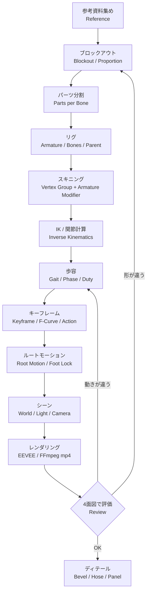

# 勉強用: 作業フローと Blender の概念（見出し単語）

詳細は WEB で補強する前提。単語は Blender の英語 UI 名を併記。

## 1. 作業フロー



## 2. 単語リスト（工程ごと）

### 全体・実行
- Headless / Background mode (`blender -b`)
- bpy / Python API
- Factory Startup
- .blend / Save As
- Scene / Collection / Object / Data (Mesh・Armature・Camera・Light)
- Object Mode / Edit Mode / Pose Mode

### モデリング
- Primitive (Cube / Cylinder / Cone)
- bmesh
- Convex Hull
- Transform (Location / Rotation / Scale)
- Local / World Space
- Normal
- Modifier Stack
- Bevel Modifier / Weighted Normal / Harden Normals
- Low Poly / Triangle Count
- Silhouette / Proportion
- Orthographic View (Front / Side / Top)

### マテリアル
- Material / Shader Node
- Principled BSDF (Base Color / Metallic / Roughness / Emission)
- Noise Texture / Color Ramp
- World (Background)
- View Transform (Standard / Filmic / AgX)

### リグ
- Armature / Bone
- Head / Tail / Roll
- Edit Bone / Pose Bone
- Rest Pose / Pose Position
- Parent / Child / Bone Hierarchy
- Deform Bone / Control Bone
- Bone Constraint (IK / Damped Track / Stretch To / Copy Rotation)
- IK Target / Pole Target / Chain Length
- FK / IK
- Matrix / matrix_local / matrix_basis

### スキニング
- Vertex Group
- Armature Modifier
- Rigid Skinning（1パーツ=1骨）
- Weight Paint / Automatic Weights

### アニメーション
- Timeline / Frame / FPS
- Keyframe / keyframe_insert
- Action / F-Curve
- Interpolation (Bezier / Linear)
- Dope Sheet / Graph Editor
- Cycle / Loop
- NLA Editor（歩容の切り替えで使う）

### 四足歩行
- Gait (Walk / Trot / Canter / Gallop)
- Phase / Phase Offset
- Duty Factor
- Stance / Swing
- Stride Length
- Foot Lock / Foot Sliding
- Spine Flex / Extension
- Scapula (肩甲骨)
- Digitigrade (つま先立ち)
- Root Motion
- Side Step / Strafe

### カメラ・出力
- Camera (Lens / Orthographic Scale)
- Track To Constraint
- Parent to Armature（追従）
- Render Engine (EEVEE / Cycles)
- Render Samples
- Output (PNG / FFmpeg / H.264)

## 3. プロパティ JSON カード

このプロジェクトで実際に使っている値。

```json
{"card": "Bone", "keys": {"head": "(0,1.2,1.75)", "tail": "(0,1.6,1.82)", "parent": "chest", "use_deform": true}}
```
```json
{"card": "PoseBone", "keys": {"rotation_mode": "QUATERNION", "location": "親から見た移動", "rotation_quaternion": "親から見た回転", "scale": "(1,k,1) ダンパーの伸縮"}}
```
```json
{"card": "ArmatureModifier", "keys": {"object": "CommandWolf", "use_vertex_groups": true}}
```
```json
{"card": "VertexGroup", "keys": {"name": "骨と同じ名前", "weight": 1.0, "type": "REPLACE"}}
```
```json
{"card": "IKConstraint", "keys": {"target": "Armature", "subtarget": "IK_FL", "pole_target": "Armature", "pole_subtarget": "POLE_FL", "chain_count": 2}}
```
```json
{"card": "Gait", "keys": {"name": "gallop", "speed": 7.5, "cycle": 16, "duty": 0.35, "phase": {"RR": 0.0, "RL": 0.1, "FL": 0.45, "FR": 0.55}, "lift": 0.5}}
```
```json
{"card": "Keyframe", "keys": {"data_path": "location", "frame": 1, "interpolation": "LINEAR"}}
```
```json
{"card": "PrincipledBSDF", "keys": {"Base Color": "(0.06,0.062,0.068)", "Metallic": 0.2, "Roughness": 0.55, "Emission Strength": 0.6}}
```
```json
{"card": "BevelModifier", "keys": {"width": 0.015, "segments": 2, "harden_normals": true, "limit_method": "ANGLE"}}
```
```json
{"card": "Camera", "keys": {"type": "ORTHO", "ortho_scale": 8.5, "lens": 32, "constraint": "TRACK_TO"}}
```
```json
{"card": "Render", "keys": {"engine": "BLENDER_EEVEE_NEXT", "fps": 30, "resolution": "1280x720", "file_format": "FFMPEG", "codec": "H264"}}
```
```json
{"card": "CLI", "keys": {"-b": "画面なしで起動", "--factory-startup": "初期設定で起動", "--python": "スクリプト実行", "--python-exit-code": 1, "--": "以降はスクリプトの引数"}}
```
